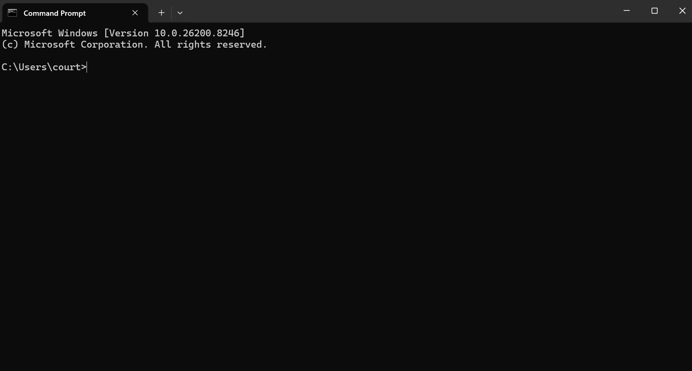
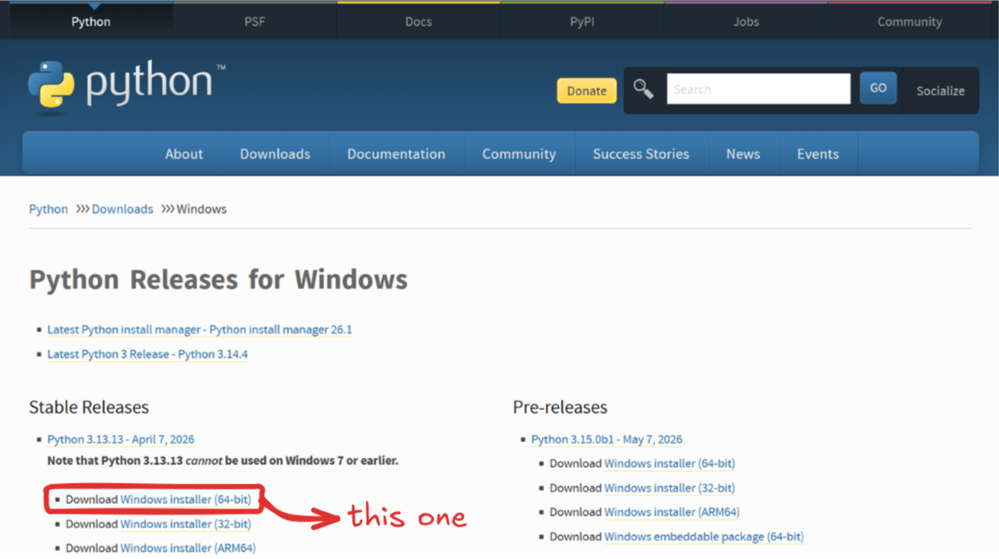
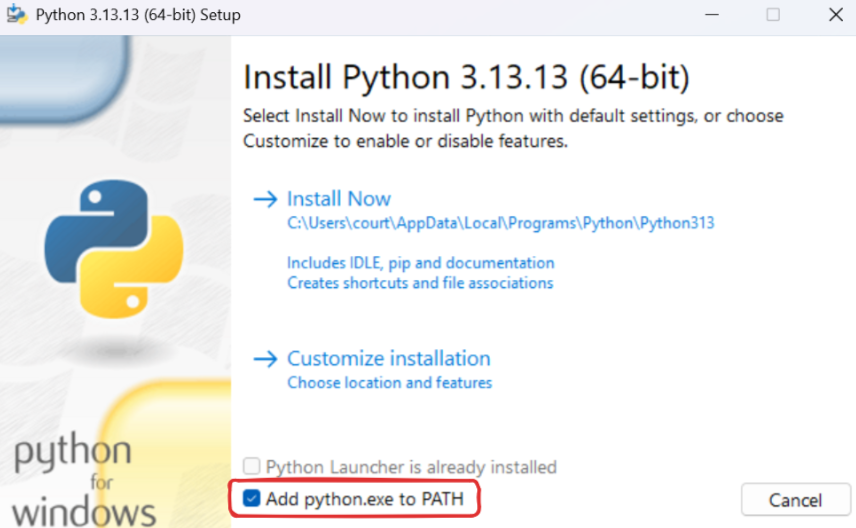
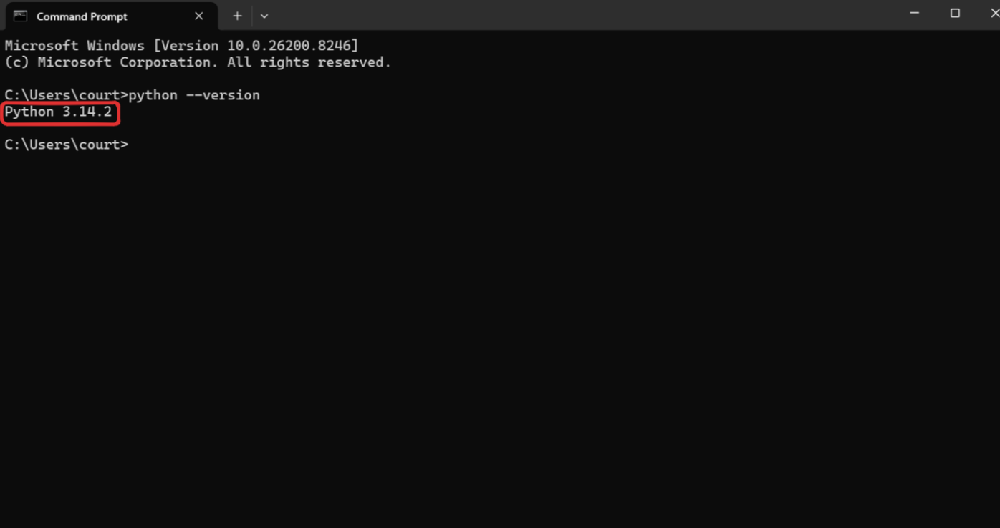
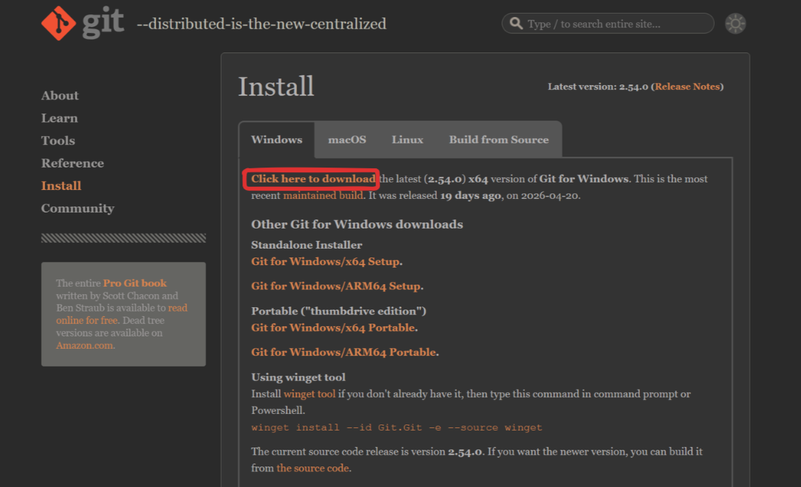
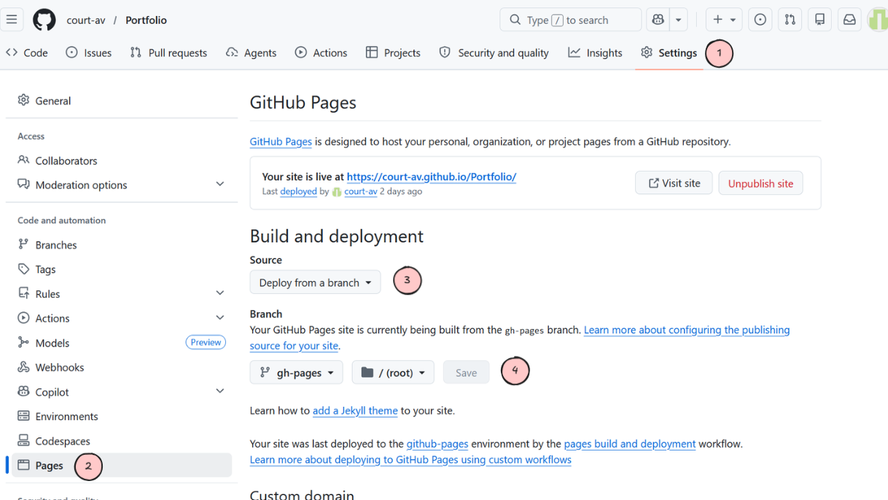

# Set Up Your Own Website

**:material-trending-up: Skill Level:** <span class="badge badge-beginner">Beginner</span>

**:material-clock-outline: Time:** 30 minutes

**:material-toolbox-outline: What You'll Need:**

- A device running Windows (laptop, tablet, desktop, etc.)
- Visual Studio Code or other code editor
- Github account

In this tutorial, you will learn how to set up your very own FREE website using MkDocs and Github Pages. Perfect for hosting your project portfolio! This tutorial walks through an installation on a Windows system.

!!! note "The installation instructions are for Windows systems only."
    The installation for MkDocs will be slightly different if using a Linux system. Instructions coming soon. Everything except for the installation steps will be the same on any operating system.

## Software Installation
To get started, you will need to install Python, MkDocs Materials, and Git for Windows.

1. Open Command Prompt. Search it in your Windows search bar or press Win+R, type `cmd`, then hit Enter.



2. Check for a Python installation. Run this in the Command Prompt:

    ````batch
    python --version
    ````

    If Python is already installed, you will see `Python 3.10.x` or higher. If you see "command not found" or the Microsoft Store opens, you need to install Python.

3. If you need to install Python, go to <python.org/downloads> and download the latest stable 64-bit Windows installation.

    

    During installation, check "Add Python to PATH."

    

    After the installation is complete, close and reopen the Command Prompt and verify with `python --version`.

    

4. Install MkDocs material. In the Command Prompt, enter:

    ````batch
    pip install mkdocs-material
    ````

5. Install Git for Windows. Download the latest stable 64-bit version from <https://git-scm.com/install/windows>. Use the default installation settings.

    

## Initial Website Deployment
The initial deployment of your very first website is easy.

1. In the Command Prompt, navigate to the file location where you would like to save this project using:

    ````batch
    cd usr\Documents
    ````

2. Create the project using MkDocs. Name your project and then navigate to it.

    ````batch
    mkdocs new project-name
    cd project-name
    ````

3. Creating the MkDocs project will automatically generate some starter files in your Project folder. Open your project in your preferred code editor, like VS Code. Open `mkdocs.yml`. Replace the code with this template:

    !!! warning "Edit the code with your username and desired repository name."
        There are 7 lines to personalize including:

        - site_name: Website Name
        - site_description: My First Website
        - site_author: Your Name
        - site_url: https://username.github.io/repository-name/
        - repo_url: https://github.com/username/repository-name
        - repo_name: repository-name
        - link: https://github.com/username

    ````yaml title="mkdocs.yml"
    site_name: Website Name
    site_description: My First Website
    site_author: Your Name
    site_url: https://username.github.io/repository-name/

    repo_url: https://github.com/username/repository-name
    repo_name: repository-name

    theme:
        name: material
        font:
            text: Inter
            code: JetBrains Mono
        features:
            - navigation.tabs
            - navigation.sections
            - navigation.top
            - navigation.instant
            - content.code.copy
            - content.code.annotate
            - search.suggest
            - search.highlight
            - toc.follow
        palette:
            - scheme: default
            primary: black
            accent: blue
            toggle:
                icon: material/weather-night
                name: Switch to dark mode
            - scheme: slate
            primary: black
            accent: blue
            toggle:
                icon: material/weather-sunny
                name: Switch to light mode
        icon:
            repo: fontawesome/brands/github

    extra_css:
    - stylesheets/extra.css

    markdown_extensions:
    - admonition
    - attr_list
    - md_in_html
    - footnotes
    - tables
    - pymdownx.details
    - pymdownx.superfences
    - pymdownx.tabbed:
        alternate_style: true
    - pymdownx.highlight:
        anchor_linenums: true
    - pymdownx.inlinehilite
    - pymdownx.snippets
    - pymdownx.emoji:
        emoji_index: !!python/name:material.extensions.emoji.twemoji
        emoji_generator: !!python/name:material.extensions.emoji.to_svg
    - toc:
        permalink: true
        toc_depth: 3

    nav:
    - Home: index.md
    - Projects:
        - Project 1: projects/project1.md
        - Project 2: projects/project2.md
    - Guides:
        - Guide 1: guides/guide1.md
        - Guide 2: guides/guide2.md

    extra:
     social:
     - icon: fontawesome/brands/github
       link: https://github.com/username

    generator: true
    ````

4. Replace index.md with the following code block.

    ````md title="index.md"
    ---
    hide:
      - navigation
      - toc
    ---
    
    # Website Name
    
    ## Site Title
    
    About me.
    
    [LinkedIn](https://linkedin.com/in/username){ .md-button .md-button--primary }
    [GitHub](https://github.com/username){ .md-button }
    
    ---
    
    ## Projects
    
    <div class="grid cards" markdown>
    
    -   :material-rocket-launch:{ .lg .middle } **Project 1**
    
        ---
    
        This is a project example.
    
        [:octicons-arrow-right-24: Read more](projects/project1.md)

    -   :material-rocket-launch:{ .lg .middle } **Project 2**
    
        ---
    
        This is a project example.
    
        [:octicons-arrow-right-24: Read more](projects/project2.md)
    
    </div>
    
    ## Guides
    
    <div class="grid cards" markdown>
    
    -   :material-book-open-variant:{ .lg .middle } **Guide 1**
    
        ---
    
        This is a guide example.
    
        [:octicons-arrow-right-24: Read more](guides/guide1.md)
    
    -   :material-book-open-variant:{ .lg .middle } **Guide 2**
    
        ---
    
        This is a guide example.
    
        [:octicons-arrow-right-24: Read more](guides/guide2.md)
    
    </div>
    
    ````

5. Create a path in your folder in your repository called "stylesheets" and create a new file named "extra.css". Paste this code into it:

    ````css title="extra.css"
    /* Refined typography */
    .md-typeset {
    font-size: 0.78rem;
    line-height: 1.7;
    }

    .md-typeset h1 {
    font-weight: 700;
    letter-spacing: -0.02em;
    margin-bottom: 0.4em;
    }

    .md-typeset h2 {
    font-weight: 600;
    letter-spacing: -0.01em;
    margin-top: 2em;
    }

    .md-typeset h3 {
    font-weight: 600;
    margin-top: 1.5em;
    }

    /* Homepage hero spacing */
    .md-typeset h1 + h2 {
    margin-top: -0.2em;
    font-weight: 400;
    color: var(--md-default-fg-color--light);
    font-size: 1.4rem;
    }

    /* Better button spacing on homepage */
    .md-typeset .md-button + .md-button {
    margin-left: 0.5rem;
    }

    /* Card grid polish */
    .md-typeset .grid.cards > :is(ul, ol) > li,
    .md-typeset .grid > .card {
    border-radius: 8px;
    transition: transform 0.2s, box-shadow 0.2s;
    }

    .md-typeset .grid.cards > :is(ul, ol) > li:hover,
    .md-typeset .grid > .card:hover {
    transform: translateY(-2px);
    box-shadow: 0 4px 16px rgba(0, 0, 0, 0.08);
    }

    /* Subtle horizontal rules */
    .md-typeset hr {
    border-bottom: 1px solid var(--md-default-fg-color--lightest);
    margin: 2.5em 0;
    }

    /* Code block refinement */
    .md-typeset code {
    font-size: 0.85em;
    border-radius: 4px;
    }

    /* Cleaner admonitions */
    .md-typeset .admonition,
    .md-typeset details {
    border-radius: 6px;
    border-width: 0 0 0 4px;
    box-shadow: none;
    }

    /* Header refinement */
    .md-header {
    box-shadow: 0 1px 0 rgba(0, 0, 0, 0.05);
    }

    /* Footer cleanup */
    .md-footer-meta {
    background-color: var(--md-default-bg-color);
    color: var(--md-default-fg-color--light);
    border-top: 1px solid var(--md-default-fg-color--lightest);
    }

    /* Max content width for better readability */
    .md-grid {
    max-width: 1280px;
    }

    .badge {
    display: inline-block;
    padding: 0.15em 0.6em;
    font-size: 0.75em;
    font-weight: 600;
    line-height: 1.4;
    border-radius: 12px;
    text-transform: uppercase;
    letter-spacing: 0.03em;
    vertical-align: middle;
    }

    .badge-beginner {
    background-color: #dcfce7;
    color: #166534;
    }

    .badge-intermediate {
    background-color: #fef3c7;
    color: #92400e;
    }

    .badge-advanced {
    background-color: #fee2e2;
    color: #991b1b;
    }
    ````

6. Check that your repository structure looks like this:

    ````text
    repository-name/
    ├── docs/                       # All Markdown Files
    │   ├── guides/                 # Guide Folder
    |   |   ├── guide1.md           # Guide 1
    |   |   └── guide2.md           # Guide 2
    │   ├── projects/               # Project Folder
    │   │   ├── project1.md         # Project 1
    |   |   └── project2.md         # Project 2
    │   └── stylesheets/            # Custom style overrides
    │       └── extra.css/          # Extra style overrides
    └── mkdocs.yml                  # Site configuration
    ````

7. Preview the site locally. In the Command Prompt, enter the command:

    ````batch
    mkdocs serve
    ````

    Open <http://127.0.0.1:8000> in your browser to preview the site you just built.


8. Create a new repository on Github. You can do this from the Command Prompt by running these commands in order:

    !!! warning "Edit the Github Link with your username and desired repository name."
    
    ````bash
    git init
    git add .
    git commit -m "Initial Deployment"
    git branch -M main
    git remote add origin
    https://github.com/username/repository_name.git
    git push -u origin main
    mkdocs gh-deploy
    ````
    When you do `git push -u origin main`, you will get directed to a Git Credential Manager website. Authorize it to continue.

9. Configure GitHub Pages. Go to your repository in your browser. In Settings, go to "Pages". Under the "Source" dropdown, select "Deploy from a branch". Under the "Branch" dropdown, select "gh-pages".

    

    At this point, your site should be live at https://username.github.io/repository-name. Edit with your username and repository name.

    Congratulations! You have your very own website that you can customize. Use the tools below to modify and customize your website.

!!! note "These steps created your initial deployment of your website. Any modifications you make past this point will need to be committed and pushed to your github and redeployed."

## Best Practices

### Testing

While testing new code, do not create a new deployment. Use a test deployment by entering `mkdocs serve` in your Command Prompt. Use `ctrl + C` to shutdown the current test deployment. The test deployment can be viewed at <http://127.0.0.1:8000>.

### Deployment

After you've made larger changes to the code or are confident in your modifications, you can redeploy your website. Type the following commands in your Command Prompt:

````batch
git add .
git commit -m "Describe what you changed here"
git push
mkdocs gh-deploy
````

You can then view your deployed website from https://username.github.io/repository-name.

## Personalize your Website

There are several ways to personalize your website. You can change the color scheme, add visual elements, change the navigation structure, and more. For full details on how to use MkDocs features, visit <https://www.mkdocs.org/>.

### Markdown Basics

#### Titles and Headings

The title is written at the top of a markdown file. It is denoted by a single hashtag (#) followed by the title:

````md
# Title
````

Headings are denoted with two hashtags (##) followed by the heading:

````md
## Heading
````

You can add up to 4 hashtags (####) to make smaller headings.

#### Adding Code Blocks

To add code blocks, use 4 backticks surrounding your code block, specify the language and title if desired.

````md
    ````language title="Title"
    Insert code block here
    ````
````

#### Bullet Points and Numbered Lists

Bullet points are created using dashes (-) or asterisks (*).

Numbered lists are created using(1., 2., 3., etc.). To group text within a number on the list, indent the text under each number. For example:

````md
1. This is an example first step.
    An indent groups this sentence under step one.

2. This is step two.
````

### Adding/Removing Pages

Create or delete .md files within your file structure. When you do so, don't forget to edit `mkdocs.yml` and `index.md` to change your home page and menu tabs.

### Changing the Theme

In your `mkdocs.yml` file, edit the following block:

````yml
  palette:
    - scheme: default
      primary: black (edit this)
      accent: blue (edit this)
      toggle:
        icon: material/weather-night
        name: Switch to dark mode
    - scheme: slate
      primary: black (edit this)
      accent: blue (edit this)
      toggle:
        icon: material/weather-sunny
        name: Switch to light mode
````

The available colors are `red`, `pink`, `purple`, `deep purple`, `indigo`, `blue`, `light blue`, `cyan`, `teal`, `green`, `light green`, `lime`, `yellow`, `amber`, `orange`, `deep orange`, `brown`, `grey`, `blue grey`, `black`, and `white`.

### Adding Images

To add images to your website, add a folder called "images" in your docs/ folder. In your .md files, use:

````md

````

### Adding Alerts

To add an alert, you will use:

````md
!!! warning "Title here"
    Important cautions.
````

You can replace `warning` with `note`, `info`, `tip`, `success`, `question`, `danger`, `bug`, `example`, or `quote` depending on what alert you are creating.

To make the boxes collapsible, change the `!!!` to `???`.

??? example "Example: Click to expand"
    This is what an expandable example looks like.

## Blocking Search Engines

To prevent your website from being searchable on search engines and AI training crawlers, you can add a "no-index" tag.

1. Create a folder called `overrides` in your project root. 

2. Add a `custom_dir` to your `mkdocs.yml`:
    ````yml
    theme:
        name: material
        custom_dir: overrides
    ````

3. Create a file in `overrides` called `main.html`.
    ````html title="main.html"
    

    
    <meta name="robots" content="noindex, nofollow">
    
    ````

4. In your `docs` directory, create a file called `robots.txt`
    ````txt title="robots.txt"
    User-agent: *
    Disallow: /
    ````

Redeploy your website.

## Troubleshooting

### Installation Troubleshooting

- If you have issues with installing MkDocs material with

    ````
    pip install mkdocs-material
    ````

    try
    ````
    python -m pip install mkdocs-material
    ````

- If mkdocs is not recognized, check your antivirus permissions to see if anything is blocking you.

### 404 Not Found Issues

If you get any pages that show up as "404 Not Found," there are several possible causes:

- Check that all .md file names in the `mkdocs.yml` and `index.md` are spelled correctly and in the correct file location.
- Check that in your Github repository settings you set the Branch to "gh-pages" as in "Initial Deployment" Step 9.
- If you made any changes to the code, you need to redeploy the test website. Make sure you enter `mkdocs serve` to view any recent edits to the code. To exit a current test deployment, use `crtl + C`.
